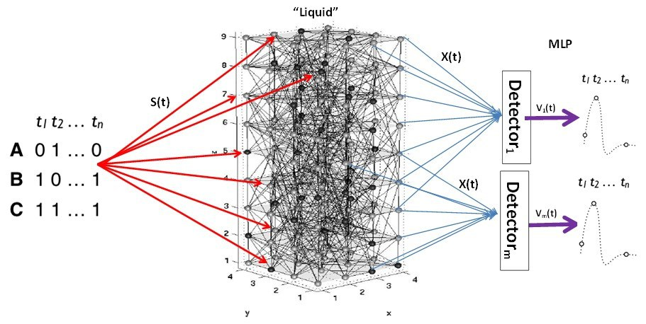
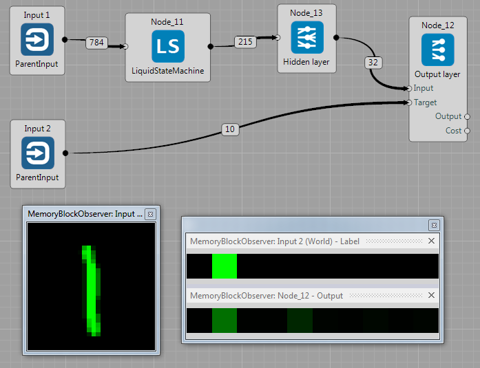
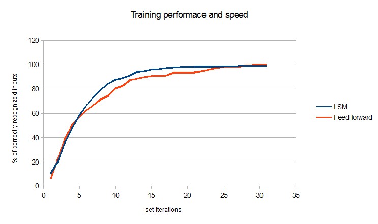
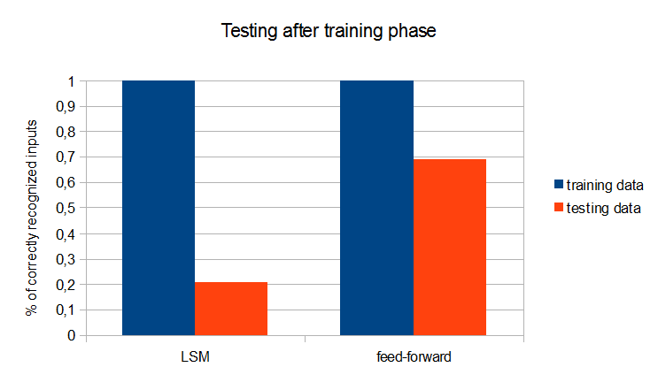
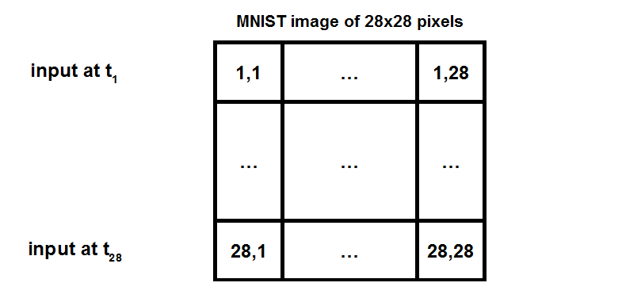
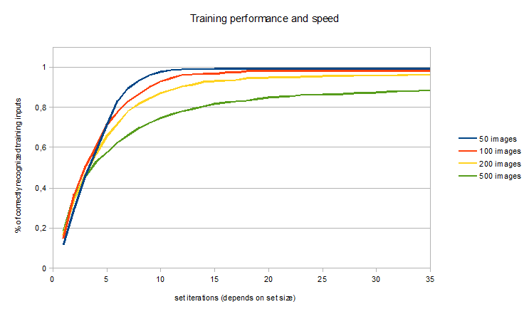

# Liquid State Machine #

Liquid State Machine (further referenced as LSM) is a spiking neural network, firstly mentioned by prof. Wolfgang Maass in 2002. The word "Liquid" comes from a reference to real liquids like water. Imagine throwing a stone into a pond. After you do it you can observe the particular molecules of the water change their state, reacting on the incoming "input". The same way you look on the water you can also look on the LSM.

**Image 1: The Liquid State Machine (LSM) principle (source: [http://hananel.hazan.org.il/the-liquid-state-machine-lsm/](http://hananel.hazan.org.il/the-liquid-state-machine-lsm/))**

LSM consists of neurons, which are connected together to be able to communicate. All of those neurons are of a type leaky integrate-and-fire (LIF). Such neurons accumulate the incoming spikes until a limit is reached and they fire a spike into all of their neighbours. They are called leaky, because through the time, if no input comes, their inner state(potential) is slowly decreased until it reaches the state of calm (which eventualy means the same state as after reset). The inner state of neuron *a* through the time is computed as stated in the following formula (see **Image 2**), where IS(t) is inner state in time t, EI(t) is external (outside of LSM) input in time t and IO(i, t) is internal output of neuron i in time t, which equals to internal input of all its neighbours in time t+1.

***Image 2: The basic equation for calculating the inner state of neurons.***

So at each time step *t* LSM takes the external input and processes it. Then all neurons compute their inner state as stated above. At the end of the step all neurons know their current inner state. As the output of LSM we use the inner state of all non-input neurons, neurons that are not receivers of external input. The output is then processed by detector (detectors), which translates it to the final output. From the previous description of LSM you can see that the expected field of use would lie somewhere around temporal patterns recognition.

Before we get to the implementation of LSM inside of Brain Simulator, there are last two questions we need answers on: How does LSM get to the calm state? and How are neurons connected?

The are usually two different ways how to get LSM to the calm state. This is needed to be done to be able to accept new pattern -> between accepting two different patterns LSM needs to be reseted! How do we reach this? We can either wait enough time for the LSM to reset itself (thanks to LIF neurons) or we can reset it manually after each pattern. In our implementation we have only the second type of reset, so we don't have to wait.

In general there are a lot of ways how to connect neurons together. First of all we have to decide is we want to have large or small connectivity. In our research we decided for the small one, but this can be changed in the setting of LSM node. But how do we choose which neurons are going to be neighbours? There are again a lot of possibilities how to do this. In our work we mainly focused on randomly selected neighbours, but we also ran some tests based on 3D topology with favouring edges to close neighbours which was proposed in the work of prof. Maass.

## Liquid State Machine node ##

The node works on principle of batches. It expects to get the whole temporal pattern spread over the time at once. It sends it over time itself inside of its inner cycle. All other input parameters needs to be preset as properties before the start of the learning phase.

During the inner cycle the LSM node calculates the change of its inner state based on incoming time-variable inputs. After the desired number of interations of the inner cycle the output is generated based on the inner state of all non-external-input neurons. After that the output is send to the detector, feed-forward network in our case, to be analyzed.

###Description of node properties###

- Connectivity - connectivity of the network, percentage of the number of edges of a complete graph
- InnerCycle - number of iterations of the inner cycle for inner state computing, should be bigger than the number of subpatterns inside of input temporal pattern
- Inputs - number of input neurons, should be equal to the length of subpatterns inside of input temporal pattern
- Threshold - threshold for firing spikes by neurons
- InitState - value of init state of a neuron
- Refractory - refractory value, on which is based how long the neuron will be in the refractory state
- RefractoryState - value of refractory state of a neuron
- PatternLength - the length of subpatterns inside of input temporal pattern
- Spikes - bool value, whether the network should be spiking
- SpikeSize - size of a spike

###Node tasks###

- Init random network
 - initialization of random connectivity network
 - parameters - number of neurons, sign whether we want c% on input or output edges
- Init Maass network
 - initialization of a network with 3D topology with favouring edges to close neighbours, which was proposed in the work of prof. Maass
 - parameters - dimensions of the network
- Compute inner state - computing of inner state
- Create output - creating of output

## LSM node in Brain Simulator environment ##

***Image 3: LSM node in Brain Simulator environment.***

###How to use the node###

1. As the input of LSM you have to set something which provides batches of temporal patterns. In our tutorial case we use MNIST images world input (explained in Testing-Temporal pattern recognition).
2. The output of LSM should be send into a detector (or its first layer like in this case). In our case into Hidden layer of feed-forward network (or directly into Output layer if we omit Hidden layer).
3. Connect Hidden and Output layer together and set the correct target to the Output layer.
4. Choose the topology of the LSM network and set the given init task and its parameters.
5. Pay a good attention to the parameters of LSM, especially to few of them: InnerCycle,  Inputs, PatternLength.
	1. InnerCycle should at least equal to (|input of LSM node|/PatternLength + 1) in order for the whole input to be creating the output (the external input affects the inner state of non-external-input neurons a round after it is first proccessed).
	2. Inputs should be equal to PatternLength. Two properties are used, because in future we want to allow them not to be equal.
6. The output of the Output layer is the result of detecting the temporal pattern.

###LSM Benchmarking node###

This node is a modification of MyCsvFileWriterNode and it serves for benchmark testing of performance of LSM. The value which is tracked and stored by this node is the ability of detector to correctly recognize input as the target. Detector recognizes the input as target if the correct value in target has the biggest score in output. The value is traced and calculated over the whole input block (whole file, input set) and then divided by the size of the block and saved as a percentage of correctly recognized inputs. This node serves purely for testing purpose. It is not needed for correct running of LSM.

**Properties:**

- OutputDirectory - directory of the file, into which it should be written
- OutputFile - name of the file, into which it should be written
- WriteMethod - sign, whether the file should be overwritten or just appended
- BlockSize - size of the block (file, set) of input temporal patterns

## Testing of LSM ##

***Image 4: Benchmark testing of LSM node in Brain Simulator environment.***

All the tests you will see below have been mainly performed on the random connectivity topology starting with default values of node's parameter. In all the cases we were trying to find better values for parameters of the LSM node, if we found one we set it to be default. Once we found the best parameter settings for each test we also tried to test the 3D topology with favouring edges to close neighbours. But the results were always almost the same or sometimes even worse. For the first two test cases the LSM code needs to be changed a little bit from the one used for temporal pattern recognition.

###Next symbol prediction###

Our main goal was to test LSM on the ability to predict the next symbol in a continuous pattern based on last few input symbols. For processing of continuous pattern we need the LSM not to be reseted, but at the same time for the ability to predict next symbol based on last few inputs we need the LSM to be reseted before the first symbol of the symbol sequence. Those two requirements creates us a collision!

The only way for a work-around in this case we would need to bend LSM to be able to fulfill both of these requirements at the same time. But in all the work-arounds we created the network was either not able to sufficiently learn or the complexity of processing the input was too big in comparing to what we expected and wanted.

After we spend a lot of time on these work-arounds we decided we are actually trying to bend the unbendable. There are other networks for this problem (LSTM, RNN, Clockwork RNN), which are able to solve this problem without any need of being bended. 

###Pattern recognition###

After failing the first testing we decided to test whether the LSM isn't able to recognize standard patterns with noise better than the feed-forward network we are using as the decoder. The main idea of this test is whether LSM is able to encode the input, which is made by inserting noise into source input, so the encoded input is more similar to encoded source input so the decoder is able to recognize it better.

In this test we need to let the LSM run the pattern more times inside of its inner circle. We were training LSM on set of 50 MNIST images and testing it on a set of different 250 MNIST images, which we considered as noisy versions of training data. After deciding what the ideal default settings was we ran a serie of same tests (LSM has randomly connected neurons!!!) and created average output of them. The results were that the LSM is after the training phase able to recognize 100% of the training set and between 20-40% of the testing set based on the settings of parameters.

***Image 5: Training performance and speed of tested network.***

The feed-forward network previously used as detector for the LSM was in the same test after the learning phace on average able to recognize correctly 100% of the training set and about 68% of the testing set. From these results (see **Image 6**) we can see, that using LSM as the encoder of input for feed-forward network doesn't have possitive impact on the result. So in which area can we find an upgrade over the feed-forward network? Somewhere, where feed-forward network on its own is not usable -> **temporal pattern recognition**.

***Image 6: Test results of testing LSM performance on pattern recognition.***

###Temporal pattern recognition###

Temporal pattern recognition is the area where LSM is supposed to give the best results at. Temporal pattern is a pattern that comes over time and needs to be in the end recognized as one pattern. This is a problem classic feed-forward network is not able to deal with. But at the same time there are (already above mentioned) networks LSTM and RNN, which are also able to solve this problem.

We were using the already (from clasic pattern recognition test) optimalized default values of parameters. We wanted to run just few basic tests to be able to tell if our implementation is even able to perform basic temporal pattern recognition. So instead of creating the environment of temporal patterns we simulated temporal patterns using MNIST images. On **Image 7** you can see, that MNIST image of size 28x28 pixels we split into 28 rows and send them as a temporal pattern over 28 times.

***Image 7: Simulation of temporal patterns using MNIST images.***

As input data we used again 50 MNIST images as training data and different 250 MNIST images as testing data, which we used for testing of recognition of patterns with noise. After the training phase we were on average able to recognize 100% of training and about 16% of testing data. See **Image 8** for training performance and speed for LSM of 243 neurons being trained on 50/100/200/500 MNIST images.

***Image 8: Training performance and speed of LSM on temporal pattern recognition.***

The problem comes when we want to compare the performance between LSM, LSTM and RNN. Our LSM node works on a batch principle, which means that it gets the whole input at once and as parameter it has set how many inputs over time the input contains. On the other hand LSTM and RNN both work on an online principle which means that they expect one itput at a time and want to return an output every single time. This constraint is in the current version (0.2.0) of Brain Simulator the reason why we can't at the current moment compare the performance of LSM against performances of LSTM and RNN. We might return to this comparing once Brain Simulator will contain batch versions of LSTM and RNN.

This project was developed by **Ondřej Kužela** (ondrej.kuzela@fit.cvut.cz) during Datalab Summer Camp 2015 at FIT CTU in Prague. In case of any questions please feel free to contact me on the given email.
