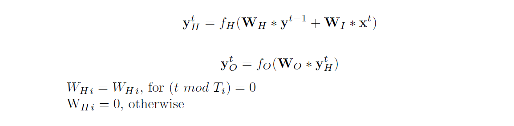

## Clockwork recurrent neural network

Clockwork recurrent neural network **CWRNN** is a specific version of recurrent neural network (RNN).

### Recurrent neural network (RNN)

The RNN is implemented in the `RNN` node. 
[RNN](https://en.wikipedia.org/wiki/Recurrent_neural_network) are neural networks with the ability to classify and predict **temporarily dependent data**. To the typical problems with complex temporal dependencies belong sequence prediction (such as handwriting and spoken word classification), sequence generation and similar. Recurrent networks can solve this problems by keeping **short-term memory** which is implemented by **using recurrent connections** (unit receives its own activation from the past step as an input).

RNN is partitioned into 3 layers:

 * input layer
 * hidden layer
 * output layer.

Input layer only provides new data to every unit in the hidden layer. Hidden layer is a fully connected graph with recurrent connections of units to itself. Every unit from hidden layer is connected to the output unit, which provides the output of the network.

### Clockwork recurrent neural network (CWRNN)

The CWRNN is implemented in the `CWRNN` node. The algorithm is based upon recurrent neural networks. It has the same basic architecture with only a small modification in the hidden layer. The **hidden layer of CWRNN is divided into separate blocks (neuron groups)**. Each of those blocks processes input at different time periods. That means that **not all units at every time step change their activation upon the actual input**. The not updated units retain this way some **information about the past** which they provide to the newly updated units and to the output units. They provide **context** from more deep history. 

The output of the network is calculated at each time step by equation:

Important to notice is, that the connections between neural groups lead only from the units with larger periods to the units with smaller periods (from "slow units" towards the "fast units"). Each group by itself is fully connected.

### How to use the Node

The CWRNN node can take any vector input. The network uses Real time recurrent learning algorithm, which is implemented inside the node. The size of the output of the node corresponds to the size of the target.

**Parameters:**
	
 * You can adjust **network size**,
	 * by changing number of groups in **NeuronGroups** 
	 * and size of the group in **NeuronsPerGroup**
 * choose **Periods** for groups
	 * every group has its own period for updating units inside the group
 * and change **learning rate** + **momentum**.
	 * parameter of RTRL task
	 * can be adjusted during run of the simulation
 * put on/off **context learning**
	 * you can experiment with sending some context (feedback) from the faster units to the slower units
	 * there are 2 possibilities how to send it:
		 * using **mean of activations** from all faster unit over the time, when a slow unit is not updated and add it to the activation of the slower unit
		 * **updating weights** going to the not updated units (even if they don't change their output)
#
	mean of activations	
	Activation context task				on
	contextByActivation	(/Settings)		1
#

#
	updating weights
	Activation context task				off
	contextByActivation	(/Settings)		1
#

#### When to Use the Node

It is suitable to use this Node if the problem:

 * **Has time dependency:** delay the input from `MnistWorld` (or any other repeating serie) and use the same as target to the network. This way you make the network predict future steps.  
 * **You want to generate series** If your network is already trained on some series (text, music etc.), you can try to generate your own. 

***
